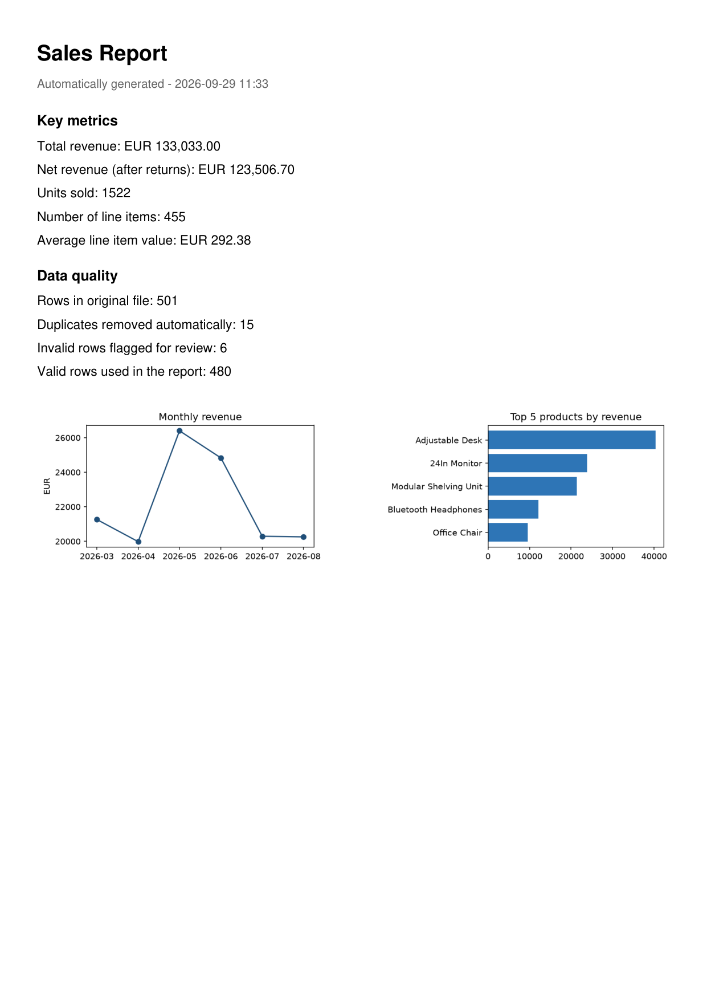

# Sales Data Cleanup & Reporting Automation

**Portfolio demo — Excel/CSV workflow automation (Python)**

## The problem

A small business exports its sales data from a POS or invoicing system as a
CSV/Excel file every week. The export is never quite clean:

- product names in different cases, with stray spaces (`" office chair "`, `"OFFICE CHAIR"`)
- dates in three different formats in the same file
- prices stored as text with currency symbols (`"89.90 EUR"`, `"€89.90"`)
- duplicate rows from re-exports
- missing fields, occasional garbage rows

Someone then spends 30–60+ minutes by hand in Excel cleaning this up before
they can even see this month's revenue, top products or trends.

## The solution

A Python script that takes the raw export and, in under a second, produces:

1. **A cleaned Excel workbook** (`processed_sales.xlsx`) with three sheets:
   - `Clean Data` — the validated, standardized dataset
   - `KPI Summary` — revenue, units sold, top products, revenue by category/region
   - `Rejected Rows` — rows that couldn't be trusted (missing/invalid date, price
     or quantity), each with the reason, so nothing is silently thrown away
2. **A one-page PDF report** (`sales_report.pdf`) with the key KPIs and
   two charts (monthly revenue trend, top 5 products), ready to send to the
   business owner.

## Before → after

| | Before | After |
|---|---|---|
| Format | Mixed dates, currency text, inconsistent casing | Standardized types, title-cased text |
| Duplicates | Present (re-export artifacts) | Removed automatically, count reported |
| Invalid rows | Mixed in with good data | Separated with a reason, nothing hidden |
| Reporting | Manual pivot tables, ~30–60 min | Excel + PDF report, <1 second |

Run against the included 501-row sample file: 15 duplicates removed, 6
invalid rows flagged, 480 clean rows processed and reported in ~0.3s.

Pre-generated results from that sample run are in
[`sample-output/`](sample-output/) — open `processed_sales.xlsx` and
`sales_report.pdf` directly, no need to run anything.



## How it works

```
data/raw_sales.csv  →  automate.py  →  output/processed_sales.xlsx
                                     →  output/sales_report.pdf
```

- **Cleaning**: normalizes text fields, parses multiple date formats, strips
  currency symbols from prices, drops exact duplicates.
- **Validation**: rows missing a valid date, price or quantity are routed to
  a separate "rejected" sheet with the reason — never silently dropped.
- **KPIs**: total/net revenue, units sold, average line item value, revenue
  by category/region, top 5 products, monthly revenue trend. (The sample
  data has no order-grouping ID — each row is one product line — so KPIs
  are reported per line item rather than per multi-item order.)
- **Output**: a formatted `.xlsx` (frozen header, autofilter, auto-sized
  columns) and a branded PDF summary with charts.

## Run it yourself

```bash
python -m venv .venv
.venv\Scripts\activate        # or: source .venv/bin/activate
pip install -r requirements.txt

python generate_sample_data.py          # creates data/raw_sales.csv
python automate.py --input data/raw_sales.csv --output-dir output
```

Works with any CSV or Excel export with equivalent columns — column
names, validation rules and KPIs are adapted per client.

## Adaptable to your data

This is a demo built on synthetic sales data. For a real engagement the
script is adapted to your actual file structure (columns, currency, date
formats) and the KPIs/report layout you actually need — inventory levels,
customer segments, regional breakdowns, low-stock alerts, automatic email
delivery, a scheduled run, etc.

## Stack

Python, pandas, openpyxl, matplotlib, fpdf2.
